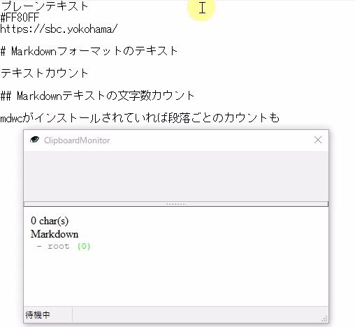
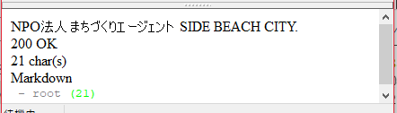
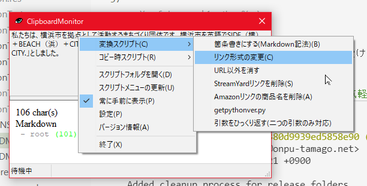

# ClipboardMonitor

A tool that monitors the clipboard and displays the text data stored in the clipboard.

You can get the number of characters stored in the clipboard and display the title pointed to by the URL.

## Install and uninstall

### install

It uses Python internally.

Please install Python from [Python official site](https://www.python.org/) etc. and enter python and commands from the command prompt so that it can be executed.

Then place the release package in your own easy-to-use folder.

### Uninstall

Delete the release package together with the folder.

Also, personal settings are placed in the `%LOCALAPPDATA%\ClipboardMonitor` folder. Delete it if necessary.

## How to use

Start CMon.exe. In the initial state, it starts resident in the task tray, but it is also possible to operate it in the state where it is displayed on the taskbar without being resident (switchable by setting).

If you copy the text to the clipboard while Clipboard Monitor is running, the contents are automatically imported, and if it is a URL, the information of the site pointed to by that address is displayed, and if it is other than that, the number of characters etc. is displayed.

### Currently supported features

These functions are realized by the Python script file under the Run folder created in the script folder.

You can also add any processing you like (see [Reference.md](Reference.md) for the processing content).

* _charcount.py: Count the number of characters. If the [mdwc](https://github.com/fnobi/mdwc) command is installed in the environment, use it to display the number of characters converted to Markdown.
* _colorcode.py: Works only when the #RGB or #RRGGBB string is copied and displays the color representation of the color code.
* _urlchecker.py: Works only when copying http or https URL, and displays the status code when accessing the URL and its title if it is a `text/html` resource.

In addition, Web access is not performed except when `_urlchecker.py` gets the title and status code of the page.

### Conversion script

It is also possible to use a conversion script that performs some processing on the character string on the clipboard from the menu.

These functions are realized by the Python script file under the Conversion folder created in the script folder.

You can also add any processing you like (see [Reference.md](Reference.md) for the processing content).

* _bullet.py: Markdown notation bullets are added to the beginning of every line.
* _changelinkformat.py: Change the link format in the text (Markdown notation -> plain text style, HTML style, etc.)
* _leaveurl.py: Remove all text from texts that contain URLs, leaving only URLs.

## Donation reception

This application accepts donations at Poiit. Please donate if you like.

* [poiit（ポイート）"誰にでも"ポイッと気軽に投げ銭できるサービス](https://poiit.me/TakamiChie)